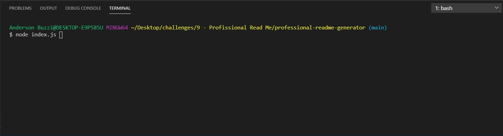

# Team Profile Generator

## Description

This application has been created to generate a team profile application, where the main goal is to help companies to manage their teams. In this generator, the user is presented with few questions on the terminal that permits them to add the informations needed for their team. The questions are the following:

What would you like to do?

- Add a new manager:

  - Please enter new manager's full name;
  - Please enter new manager ID number;
  - Please enter new manager's email;
  - Please enter their office number

- Add a new engineer:

  - Please enter new engineer's full name;
  - Please enter new employee's ID number;
  - Please enter the new employee's email;
  - Please enter employee's GitHub username.

- Add an intern:

  - Please enter new intern's full name;
  - Please enter new intern ID number;
  - Please enter the intern's email;
  - Please enter intern's school.

Walkthrough video of the readMe Generator

## Table of Contents

- [Installation](#installation)
- [Usage](#usage)
- [License](#license)
- [Questions](#questions)

## Installation

This application has been created using node.js. To run this application please make sure to have node.js installed in your computer and run the following command in your terminal.

`<npm install inquirer>`

## Usage

This application has been made to help companies to uptimize their time and have their team profile created in minutes with all the information needed just answering a few questions.

Below screenshots of some of the features for reference.

- First step: Enter node index.js to start application;

  

- Questions will be displayed in the terminal;

  

- After answering all the questions a team profile file will be generated containing your team information.

  

## License

This project is covered under MIT license.

[Click here to learn more about this license](https://opensource.org/licenses/MIT)

## Questions

Please feel free to contact me if you have any question or need any further information.

- [GitHub Profile](andybuzzi.github.com)

- [Email Address](andy@gmail.com)
